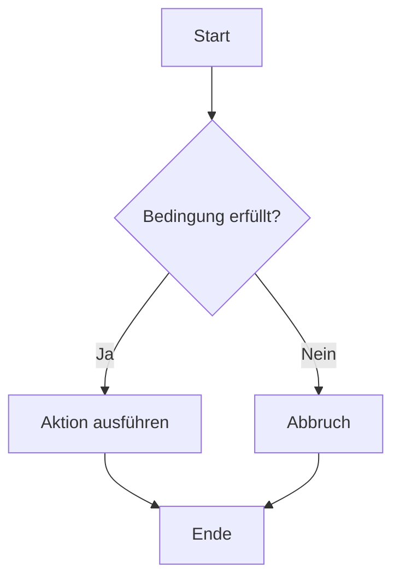
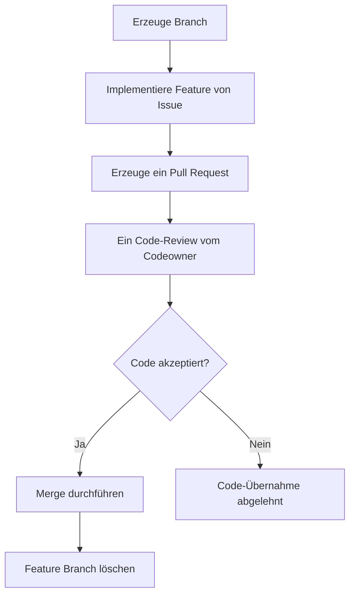

# GitHub Workshop

Loremn impsum

[🐞Bug Melden](https://github.com/GregorBiswanger/t-807-Hello-GitHub/issues/new?template=bug_report.md&labels=feature&title=Fehler%20gefunden)

```javascript
console.log('Hello World');
```
blub




